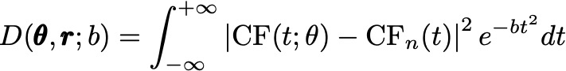
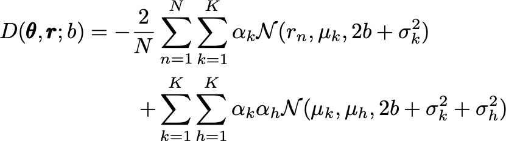
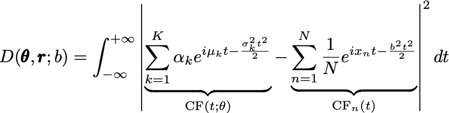

# GaussianMixturesCECF

Estimate Gaussian mixture models using a variation of the Continuous Empirical Characteristic Function (CECF) method introduced in (Xu & Knight, 2010).

The idea is to estimate parameters of a Gaussian mixture by minimizing the distance between the _empirical_ characteristic function `CF_n(t)` and the _theoretical_ one `CF(t; theta)`. The distance measure is given by the following integral (see eq. 6 from the paper):



As shown in the paper, for Gaussian mixtures this integral can be solved analytically,
which results in the following expression for the distance measure:



This is a simplified version of eq. 14 from the paper. The following notation is used in this equation:

- `theta` are parameters of the mixture:
    - weights `alpha`,
    - means `mu`,
    - variances `sigma^2`;
- `r` is the vector of data points (real numbers);
- `b > 0` is the parameter of the weighting function `exp(-b t^2)`, where `t in R` is the argument of the characteristic function.

Since multiplying by the weighting function introduces `b` into the _theoretical_ CF as well as the empirical one, one could use a "Kernel Characteristic Function Estimate", which is the characteristic function of the usual kernel density estimate, to keep the `b` only in the empirical CF only:



This potentially reduces the influence of `b` on the resulting estimate.

The paper provides a method of calculating `b` automatically, but this is not yet implemented, so users should supply `b` explicitly.

## Usage

The API is Sklearn-like:

```julia
n_components = 3
gmm = GaussianMixture(n_components)
params_vector = fit!(gmm, data, b=0.01)
p, mu, sigma = get_mix_params(params_vector)
```

If multiple similar mixtures need to be estimated, `GaussianMixture` can keep track of the last estimates and use them as the initial guess for the optimizer. This can increase performance since optimization will likely begin near the optimum:

```julia
# 1. Get params for current `data` and save them in `gmm`
params_vector = fit!(gmm, data, b=0.01, update_guess=true)

# 2. Automatically use these parameters
# as initial guess for estimation with `data_new`
params_vector_new = fit!(gmm, data_new, b=0.01, update_guess=true)
```

One can also supply the initial guess to both `GaussianMixture` and `fit!`:

```julia
using ComponentArrays

# Mixture of 2 components:
# weights: p1, p2 = 0.5, 0.5
# means: mu1, mu2 = 0, 0
# standard deviations: sigma1, sigma2 = 1e-3, 2e-3
gmm = GaussianMixture(
    ComponentVector(p=[0.5, 0.5], mu=[0, 0], sigma=[1e-3, 2e-3])
)

# Can also provide a different initial guess like this
fit!(gmm, data, b=0.01, θ0=[0.5, 0.5, -1, 1, 1e-3, 2e-3])
```

## References

- Xu, Dinghai, and John Knight. 2010. "Continuous Empirical Characteristic Function Estimation of Mixtures of Normal Parameters." Econometric Reviews 30 (1): 25–50. <https://doi.org/10.1080/07474938.2011.520565>.
