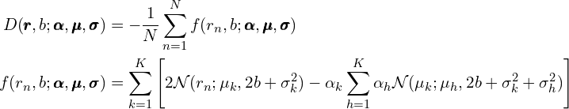

# Generate functions to compute gradients and Hessians using Symbolics.jl

The `D(r, b, θ)` function from Xu (eq. 7) can be represented in the standard "sum of functions `f` over data points" way, like for maximum likelihood.

This lets us compute the observed Fisher matrix as the mean of `f`'s Hessians for different data poits `r_n`.
